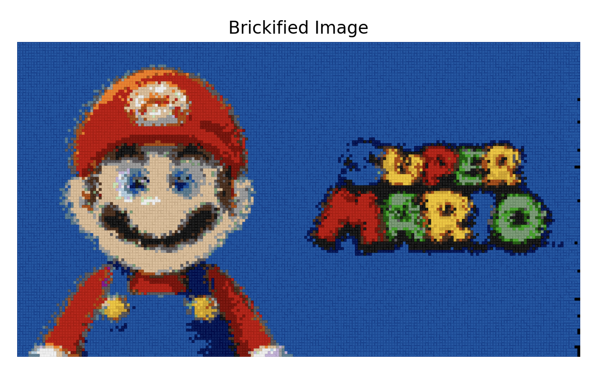

# 🧱 LegoBrickify
Turn any image into a LEGO® brick blueprint

## 📌 Overview
LegoBrickify takes an input image and analyzes it to determine the exact LEGO bricks you would need to recreate it. Whether you’re building pixel art, custom LEGO portraits, or creative designs, LegoBrickify helps you translate any image into a brick-by-brick shopping list.

## 🔥 Example:
Using following brick types, here is the outcome:
```
BRICK_TYPES = [(1, 4),
               (2, 4),
               (2, 6),
               (2, 1)]
```



## 🚀 Features
- **Image-to-Brick Conversion** – Upload any image, and get a breakdown of required LEGO bricks.
- **Color Matching** – Matches image pixels to the closest LEGO brick colors.
- **Brick Count Optimization** – Groups similar colors and sizes to minimize the number of pieces.
- **Customizable Output** – Choose brick size (1x1, 2x2, etc.) and resolution.
- **Downloadable Parts List** – Export a shopping list for your LEGO build.

## 🛠 How it works
1- Upload an image.
2- The system processes the image, mapping each pixel to the nearest LEGO-compatible color.
3- The algorithm groups bricks by color and size for efficient building.
4- You get a complete list of required LEGO parts and quantities.

## 📦 Installation
1- Make sure you have Python 3.7+ installed.
2- Install the required Python packages:
 ```
 pip install opencv-python numpy matplotlib scikit-learn
 ```
3- Clone or download the repository.
4- Make sure you have the `colors.py` file with the LEGO_COLORS dictionary in the project directory.
5- Place your input image somewhere accessible (update the path in main.py accordingly).

## ▶️ Usage
1- Define your brick types and image path in `main.py`:

```
BRICK_TYPES = [(1, 4),
               (2, 4),
               (2, 6),
               (2, 1)]

image_path = "/path/to/your/image.jpg"
```
2- Run the script:
```
python main.py
```
3- The script will generate and display the LEGO mosaic for the specified image.

## 📚 Technologies Used
- **OpenCV** – Image processing and drawing
- **NumPy** – Numerical operations on image data
- **Matplotlib** – Displaying the final mosaic
- **scikit-learn** – Color quantization with KMeans clustering
- **Custom LEGO colors** – Mapping colors to LEGO palette

